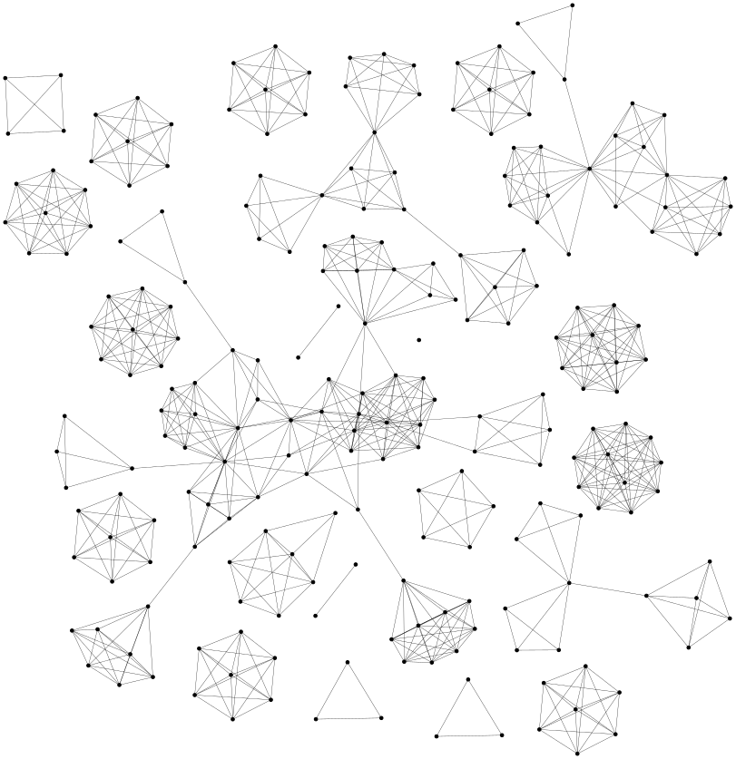

[](https://travis-ci.com/zhaofeng-shu33/nips-authorship)

Currently, the data is freely available at [nishma-laitonjam/S-AGM](https://github.com/nishma-laitonjam/S-AGM/blob/master/MatlabComparison/Datasets/nips_1-17.mat)

## NIPS-234


```shell
python3 experiment_nips_author.py --seed=1 --num_times=10 --evaluate=2
```
produces the following result:
[Table](https://programmierung.oss-cn-shenzhen.aliyuncs.com/research/info-clustering/experiment/nips-authorship/compare.html)

# NIPS-full
```shell
python experiment_nips_author.py --report_times --save_tree=2 --load_graph=nips-full.gml --evaluate=0
```